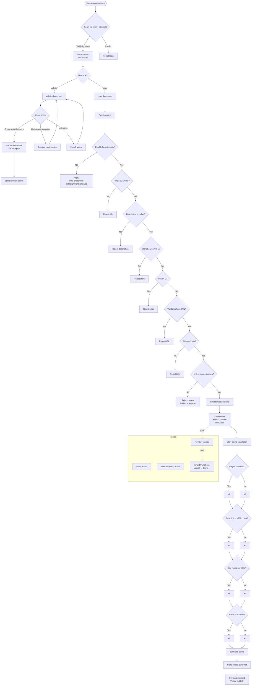

# Business Rules – Syspoints

## Users
- Users can register using:
  - Wallet
  - Email (wallet is auto-generated)
- Each user has:
  - name
  - email
  - avatar
  - role (`user` or `admin`)

## Establishments
- Reviews can only be created for predefined establishments
- Examples:
  - stores
  - restaurants
  - services

## Reviews
A review:
- Cannot be edited or deleted
- Must include:
  - Choose listed store, restaurant or service
  - Title (short, standard title)
  - Images about product or service
  - Description (minimum length enforced)
  - Star rating (0 to 5)
  - Product or service price
  - URL of purchase or consumption
  - Tags / labels
  - Timestamp (automatic)

Validation rules
- `description` must be at least 1 character long (minimum length is enforced; exact threshold is 1 until specified).
- `title` is required and must contain at most 12 words.
- `stars` must be between 0 and 5.
- `price` must be greater than 0 (PEN).
- `purchase_url` must be a valid URL.
- `tags` must contain at least one value.
- Evidence images must be between 1 and 3.

### Evidence
- User must upload images to validate usage or purchase
- Each review must include between 1 and 3 evidence images

## Points system
Points are awarded per review:

- Upload images:
  - yes → 1 point
  - no → 0 points

- Review description:
  - > 200 characters → 2 points
  - ≤ 200 characters → 1 point

- Star rating provided:
  - yes → 1 point
  - no → 0 points

- Product/service price:
  - < 100 PEN → 1 point
  - ≥ 100 PEN → 2 points

## Administration
- Point values must be configurable by an administrator
- Products must be added by an administrator
- Each user have a dashboard

Admin rules
- Only `admin` users can create establishments.
- Only `admin` users can update points configuration.
- Only `admin` users can list all users.
- Reviews list is public (frontend homepage).

Authentication
- Login is wallet-only via signature.

## States and Transitions

User
- States: `active`
- Invalid transitions: none specified

Establishment
- States: `active`
- Invalid transitions: none specified

Review
- States: `created`
- Invalid transitions: `update`, `delete`

## Flowchart Diagram

