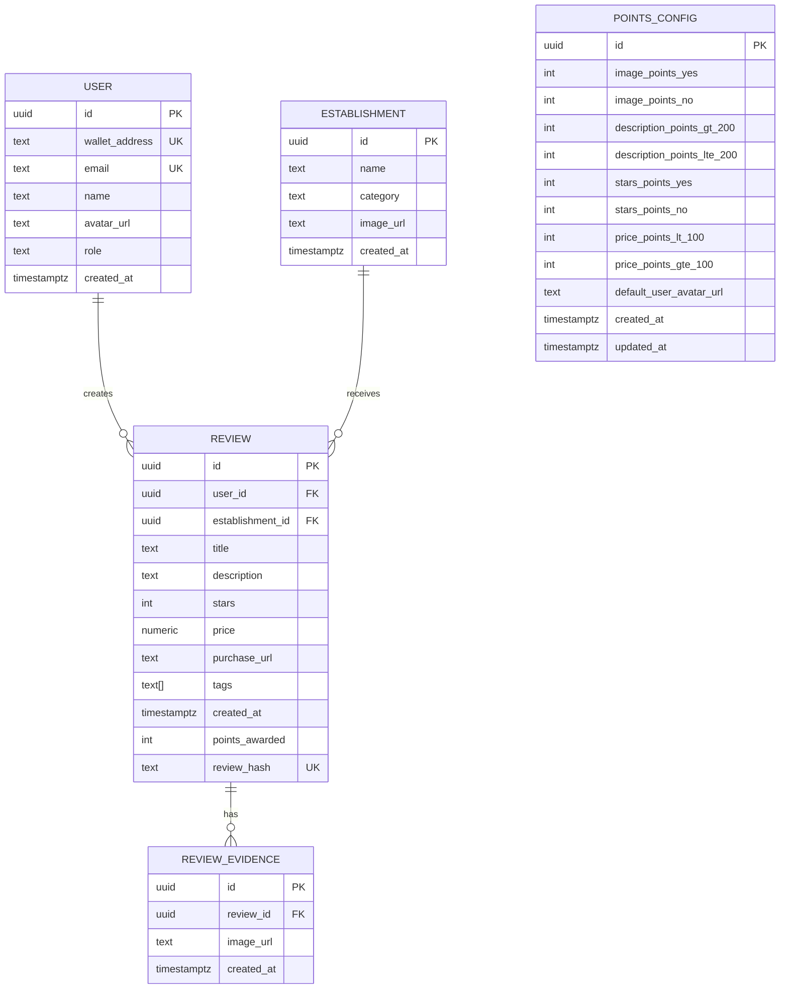

# Data Model – PostgreSQL

This document defines the persisted entities as the contract for the backend. All fields are required unless explicitly marked as optional.

## User

| Field | Type | Required | Unique | Notes |
| --- | --- | --- | --- | --- |
| id | UUID | yes | yes | Generated by backend |
| wallet_address | TEXT | yes | yes | If user registers with email only, wallet is auto-generated |
| email | TEXT | optional | yes | May be null when registering with wallet |
| name | TEXT | yes | no |  |
| avatar_url | TEXT | yes | no |  |
| role | TEXT | yes | no | `user` or `admin` |
| created_at | TIMESTAMPTZ | yes | no | Automatic |

Constraints
- At least one of `wallet_address` or `email` must be present at creation time.

## Establishment

| Field | Type | Required | Unique | Notes |
| --- | --- | --- | --- | --- |
| id | UUID | yes | yes | Generated by backend |
| name | TEXT | yes | no |  |
| category | TEXT | yes | no |  |
| image_url | TEXT | optional | no | Public URL of establishment image |
| created_at | TIMESTAMPTZ | yes | no | Automatic |

## Review

| Field | Type | Required | Unique | Notes |
| --- | --- | --- | --- | --- |
| id | UUID | yes | yes | Generated by backend |
| user_id | UUID | yes | no | FK to User |
| establishment_id | UUID | yes | no | FK to Establishment |
| title | TEXT | yes | no | Max 12 words (validated by API) |
| description | TEXT | yes | no | Minimum length enforced (see Business Rules) |
| stars | INT | yes | no | Range 0–5 |
| price | NUMERIC | yes | no | In PEN |
| purchase_url | TEXT | yes | no | URL of purchase or consumption |
| tags | TEXT[] | yes | no | Must be non-empty |
| created_at | TIMESTAMPTZ | yes | no | Automatic |
| points_awarded | INT | yes | no | Calculated by backend |
| review_hash | TEXT | yes | yes | Hash of review metadata stored on-chain |

Constraints
- `tags` must contain at least one element.
- `review_hash` must be unique.
- `title` must be non-empty.

## ReviewEvidence

| Field | Type | Required | Unique | Notes |
| --- | --- | --- | --- | --- |
| id | UUID | yes | yes | Generated by backend |
| review_id | UUID | yes | no | FK to Review |
| image_url | TEXT | yes | no | Evidence image URL |
| created_at | TIMESTAMPTZ | yes | no | Automatic |

Constraints
- Between 1 and 3 `ReviewEvidence` records must exist for each Review (validated by API).

## PointsConfig

Single-row configuration used to compute points.

| Field | Type | Required | Unique | Notes |
| --- | --- | --- | --- | --- |
| id | UUID | yes | yes | Generated by backend |
| image_points_yes | INT | yes | no | Points when evidence images exist |
| image_points_no | INT | yes | no | Points when no evidence images |
| description_points_gt_200 | INT | yes | no | Points when description length > 200 |
| description_points_lte_200 | INT | yes | no | Points when description length <= 200 |
| stars_points_yes | INT | yes | no | Points when stars provided |
| stars_points_no | INT | yes | no | Points when stars missing |
| price_points_lt_100 | INT | yes | no | Points when price < 100 |
| price_points_gte_100 | INT | yes | no | Points when price >= 100 |
| default_user_avatar_url | TEXT | optional | no | Default avatar URL for users without avatar |
| created_at | TIMESTAMPTZ | yes | no | Automatic |
| updated_at | TIMESTAMPTZ | yes | no | Automatic |

## Entity-Relationship (ER) Diagrams

