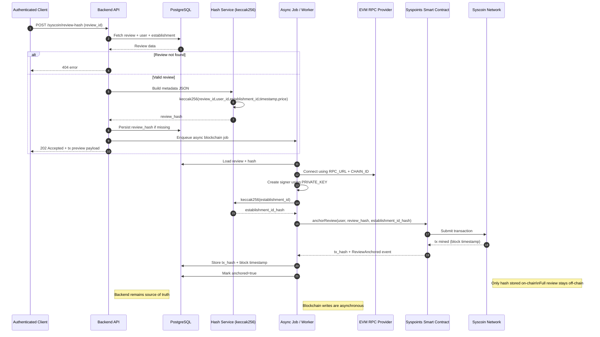

# Syscoin Integration

## Purpose (Definido en los docs)
- Store an immutable hash of review metadata on-chain.
- Do NOT store full review data on blockchain.
- Backend remains the source of truth.
- Blockchain interaction is asynchronous.
- On-chain event includes block timestamp.

## Hash Content (Definido en los docs)
The JSON used for hashing includes:
- review_id
- user_id
- establishment_id
- timestamp
- price

Hashing method
- Hash is computed using keccak256 with fixed field order:
  - review_id, user_id, establishment_id, timestamp, price (all as strings)
- establishment_id is also hashed on-chain as `establishment_id_hash = keccak256(establishment_id)`.

## Network Configuration

### Extraido del .env

| Variable | Value | Notes |
| --- | --- | --- |
| RPC_URL | https://rpc-pob.dev11.top | EVM JSON-RPC endpoint |
| CHAIN_ID | 57042 | EVM chain id |
| PRIVATE_KEY | present (redacted) | Used to sign transactions |
| CONTRACT_ADDRESS | set | Contract address for Syspoints on devnet |

### Pendiente de definicion

| Item | Status | Notes |
| --- | --- | --- |
| Network name | missing | Not present in `.env` |
| Contract ABI / method | defined in repo | `anchorReview(address user, bytes32 reviewHash, bytes32 establishmentId)` |
| Gas strategy | missing | No policy defined |
| Confirmations required | missing | Not specified |

## Technical Dependencies

### Definido en los docs
- None specified.

### Definido en el repo
- `ethers` v5 (backend uses `Contract`).
- Provider: JsonRpcProvider using `RPC_URL`.
- Signer: Wallet with `PRIVATE_KEY` + provider.
- ABI uses `anchorReview(address user, bytes32 reviewHash, bytes32 establishmentId)` and `ReviewAnchored` event.

## Backend Usage (How vars are used)

### Definido en los docs
- Backend generates the review hash.
- Hash is stored on-chain asynchronously.

### Extraido del .env
- `RPC_URL` is required to connect to the Syscoin EVM network.
- `CHAIN_ID` must match the network to avoid signing on the wrong chain.
- `PRIVATE_KEY` is required to sign the transaction that stores the hash.
- `CONTRACT_ADDRESS` is required to call the Syspoints contract.

### Pendiente de definicion
- Exact on-chain write flow (contract call vs. raw transaction).
- Where/how the async job is triggered (queue, cron, hook).

## Endpoints Dependent on Syscoin

### Definido en los docs
- `POST /syscoin/review-hash` submits a review hash to Syscoin asynchronously.

### Pendiente de definicion
- Contract address, ABI, and method for storing the hash on-chain.

## API Contract (Syscoin)

`POST /syscoin/review-hash`
- Purpose: submit a review hash to Syscoin devnet asynchronously.
- Security: requires `Authorization: Bearer <token>`.
- Behavior: sends transaction and returns `tx_hash` without waiting for confirmations.
- Request body:
```json
{
  "review_id": "uuid"
}
```
- Response `202`:
```json
{
  "review_id": "uuid",
  "review_hash": "hash",
  "user_wallet": "0x...",
  "establishment_id_hash": "0x...",
  "tx_hash": "0x...",
  "payload": {
    "review_id": "uuid",
    "user_id": "uuid",
    "establishment_id": "uuid",
    "timestamp": "2026-02-09T12:00:00Z",
    "price": 90.5
  }
}
```
- Errors:
  - `400` validation error
  - `404` review not found

## Common Integration Errors

### Definido en los docs
- None specified.

### Pendiente de definicion
- RPC down / unreachable (`RPC_URL` not responding).
- Chain ID mismatch (signing for wrong network).
- RPC timeout.
- Invalid or missing `PRIVATE_KEY`.
- Insufficient funds for gas.

## Sequence Diagram

