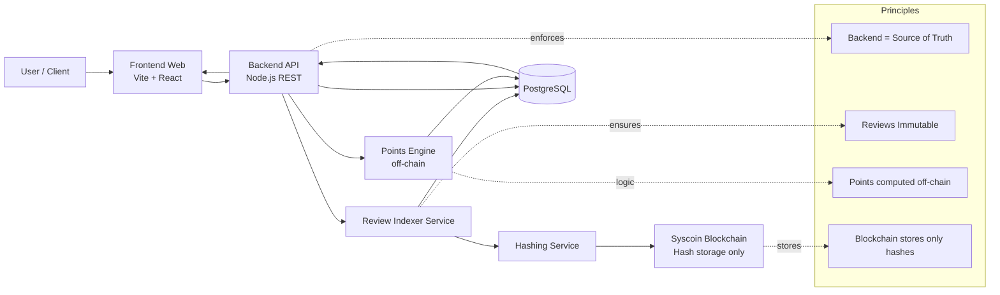

# Syspoints – System Architecture

## Stack
- Frontend: Vite + React
- Backend: Node.js (REST API)
- Database: PostgreSQL
- Blockchain: Syscoin (hash storage only)

## High-level principles
- Reviews are immutable (cannot be edited or deleted)
- Backend is the source of truth
- Blockchain stores only hashed review metadata
- Points are computed off-chain

## Current focus
Backend review indexer and API

## C4 Container Diagram

