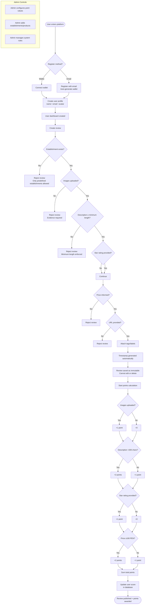

# Business Rules – Syspoints

## Users
- Users can register using:
  - Wallet
  - Email (wallet is auto-generated)
- Each user has:
  - name
  - email
  - avatar

## Establishments
- Reviews can only be created for predefined establishments
- Examples:
  - stores
  - restaurants
  - services

## Reviews
A review:
- Cannot be edited or deleted
- Must include:
  - Choose listed store, restaurant or service
  - Images about product or service
  - Description (minimum length enforced)
  - Star rating (1 to 5)
  - Product or service price
  - URL of purchase or consumption
  - Tags / labels
  - Timestamp (automatic)

### Evidence
- User must upload images to validate usage or purchase

## Points system
Points are awarded per review:

- Upload images:
  - yes → 1 point
  - no → 0 points

- Review description:
  - > 200 characters → 2 points
  - ≤ 200 characters → 1 point

- Star rating provided:
  - yes → 1 point
  - no → 0 points

- Product/service price:
  - < 100 PEN → 1 point
  - ≥ 100 PEN → 2 points

## Administration
- Point values must be configurable by an administrator
- Products must be added by an administrator
- Each user have a dashboard 

## Flowchart Diagram

