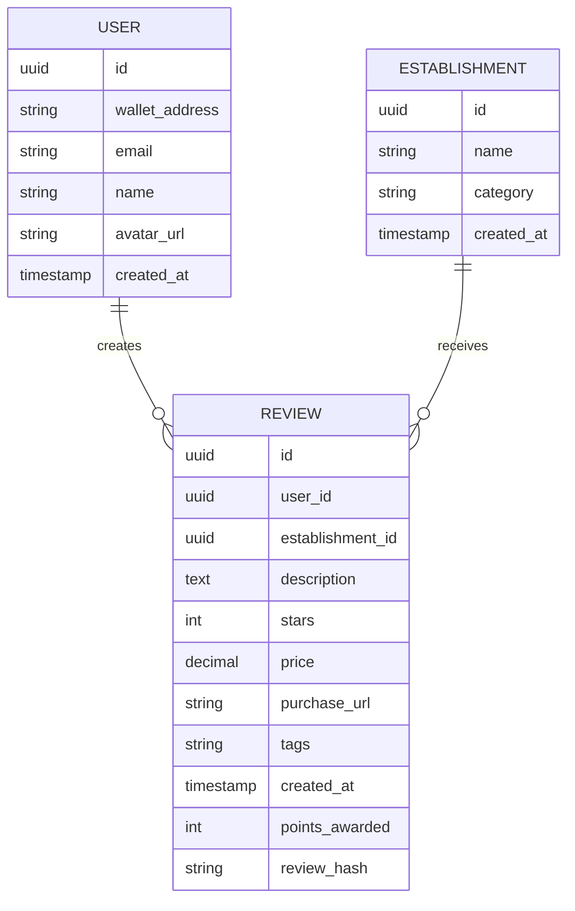

# Data Model – PostgreSQL

## User
- id
- wallet_address
- email
- name
- avatar_url
- created_at

## Establishment
- id
- name
- category
- created_at

## Review
- id
- user_id
- establishment_id
- description
- stars
- price
- purchase_url
- tags
- created_at
- points_awarded
- review_hash

## Entity-Relationship (ER) Diagrams

