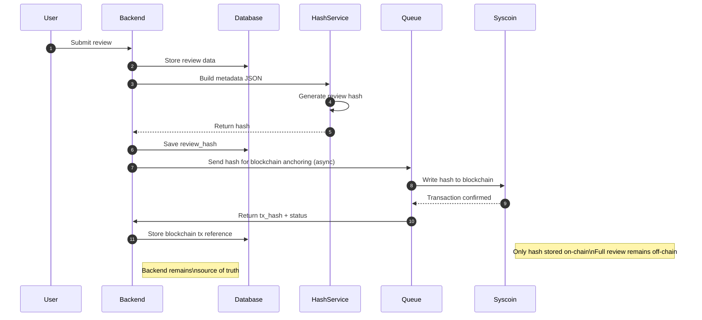

# Blockchain Integration

## Purpose
- Store an immutable hash of review metadata on-chain
- Do NOT store full review data on blockchain

## Hash content
The JSON used for hashing includes:
- review_id
- user_id
- establishment_id
- timestamp
- price

## Notes
- Hash is generated backend-side
- Blockchain interaction is asynchronous
- Backend remains the source of truth

## Sequence Diagram

